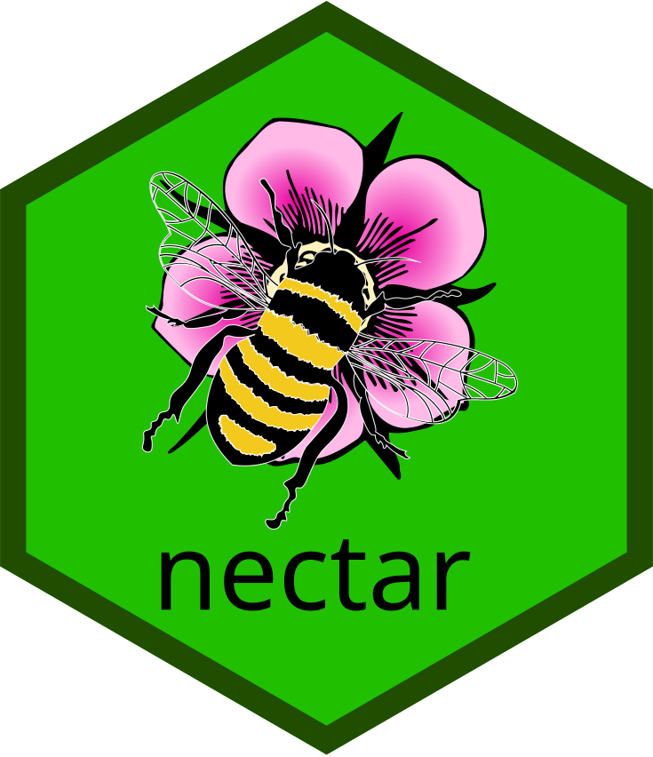

<!-- README.md is generated from README.Rmd. Please edit that file -->

```{r, include = FALSE}
knitr::opts_chunk$set(
  collapse = TRUE,
  comment = "#>",
  fig.path = "man/figures/README-",
  out.width = "100%"
)
```

# nectar <a href="https://nectar.api2r.org"></a>

<!-- badges: start -->
[](https://lifecycle.r-lib.org/articles/stages.html#experimental)
[](https://CRAN.R-project.org/package=nectar)
[](https://app.codecov.io/gh/api2r/nectar)
[](https://github.com/api2r/nectar/actions/workflows/R-CMD-check.yaml)
<!-- badges: end -->

An opinionated framework for use within api-wrapping R packages.

## Installation

You can install the development version of nectar from [GitHub](https://github.com/) with:

``` r
# install.packages("pak")
pak::pak("api2r/nectar")
```

## Usage

nectar provides an opinionated framework for building R packages that wrap web APIs.
The three core functions compose into a natural pipeline:

1. Prepare a request (attach auth, pagination, and tidy functions)

```{r usage1, eval = FALSE}
req <- req_prepare(
  "https://api.crossref.org/works",
  query = list(
    rows = 10, cursor = "*", select = c("publisher", "DOI"), .multi = "comma"
  ),
  tidy_policy = tidy_policy_json(subset_path = c("message", "items")),
  pagination_fn = iterate_with_json_cursor(
    param_name = "cursor",
    next_cursor_path = c("message", "next-cursor")
  )
)
```

2. Perform the request (handles pagination and retries automatically)

```{r usage2, eval = FALSE}
resps <- req_perform_opinionated(req, max_reqs = 2)
```

3. Parse all responses into a single tibble

```{r usage3, eval = FALSE}
result <- resp_parse(resps)
result
```

See `vignette("nectar")` for a full walk-through.

## Code of Conduct

Please note that the nectar project is released with a [Contributor Code of Conduct](https://nectar.api2r.org/CODE_OF_CONDUCT.html). By contributing to this project, you agree to abide by its terms.
